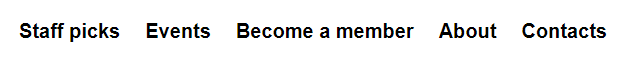
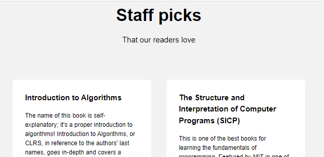
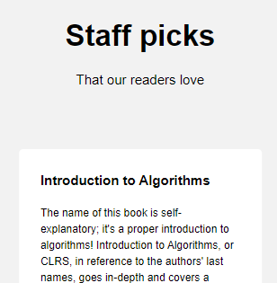
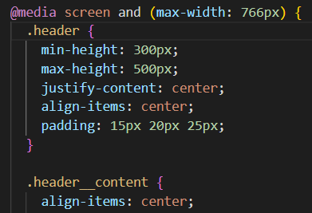

# Practicum Project 1: Practicum Library

## Project Features:

### HTML/CSS Basics

**Division of Setions**

The page is clearly divided to seperate content by category in a way that is aesthetically pleasing.

**Element positioning**

One element was intially positioned using "position: absolute" as an introduction to the concept, however this was later corrected and all other elements were positioned in the flow to maintain best practice.

**Page Navigation**

A navigation bar at the top of the page was created, and each section of the page was given an id tag to allow for quick access.

### Responsive Web Design

**Flexbox and Grid Layout**

Flexbox and grid layout were used to ensure elements moved and resized appropriately at different screen resolutions.

**Media Queries**

Media queries were also used at various resolutions to ensure smooth and seemless transitions through different screen resolutions.

## Site Link

Click [here](https://davidmiles1925.github.io/se_project_library/) to visit the site.
